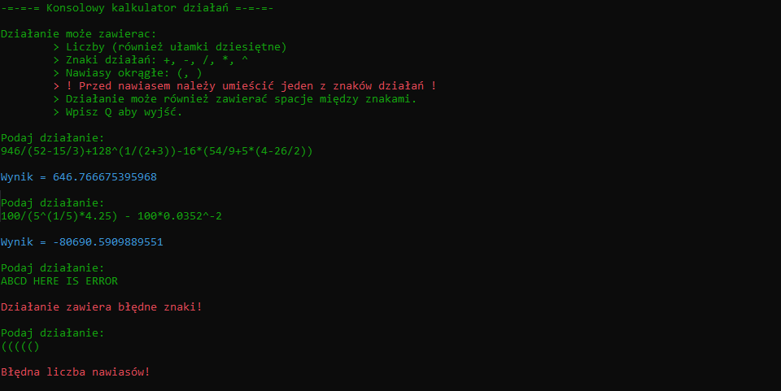

# Equation calculator

>A console program that allowas to calculate equations like this: `(5-2*10)^3-6+25^(1/2)*34`.

## Table of contents

- [Equation calculator](#equation-calculator)
  - [Table of contents](#table-of-contents)
  - [General info](#general-info)
  - [Technologies](#technologies)
  - [Setup](#setup)
  - [Features](#features)
  - [Youtube video](#youtube-video)
  - [Screenshots](#screenshots)
  - [Status](#status)
  - [Why did I create it](#why-did-i-create-it)
  - [Contact](#contact)

## General info

The program was kinda hard to make. Firstly we need find every calculations in brackets. Then we can calculate them with appropriate priority. Then we find bugs in code :) Then we fix them and pray that it works! And the working version is upload here!

## Technologies

* .NET Framework 4.7.2

## Setup

TBD

## Features

* Calculate any give equation
* One language: Polish

To upgrade:

* Add english language
* Find unknown
* Show graph(?)

## Youtube video

TBD

## Screenshots

## Status

Project is _expansionable_.

That means it is finished and I like how it works. But I am open to any issues connected to it (such as bug fix or adding new features in the long long future).

## Why did I create it

The first idea was about finding unknown in equation, but then I changed it up to quite simple program. I think about implement that feature but we're gonna see. 

## Contact

You can find contact information [here](https://jacek-jendrzejewski.azurewebsites.net/Contact).
